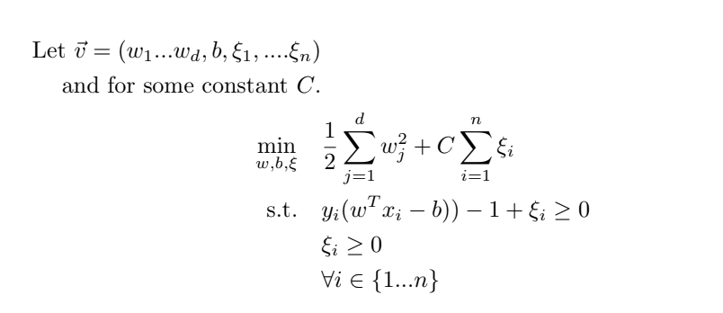
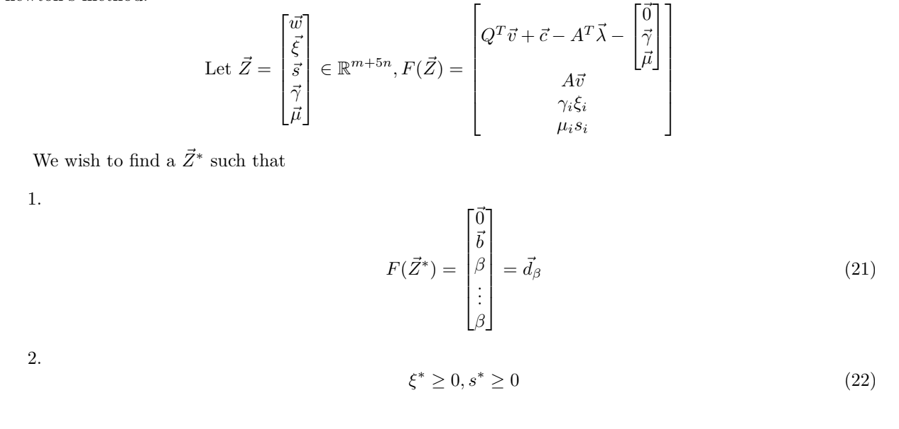

# Derrick Kim's undergraduate thesis

## Content

1.  Quadratic Programming
2.  Karush-Kuhn Tucker Conditions
3.  Newton's Method
4.  Interior Point Method
5.  Support Vector Machines Quadratic Program Formulation 
6.  Primal Log Barrier Problem
7.  Final Formulation
8.  Final thoughts

## Part 1: Quadratic Programming

A linearly-constrained quadratic programming problem is a constrained optimization problem where we
minimize a convex quadratic function subject to linear constraints.

In this paper, I try to add a variety of conditions and techniques to uniquely formulate a higher dimension problem, and attempt to solve it.

## Part 2: Karush-Kuhn Tucker Conditions

Given a general function that we want to minimize, the optimal solution necessarily has to follow the KKT
conditions. The KKT conditions are derived from the standard Lagrangian multiplier approach with stationarity, primal feasibility, dual feasibility, and complementary slackness conditions.

## Part 3: Newton's Method

Newton’s method is an iterative method that helps us find the root of a function. We start with an initial
guess that is a good approximation of the root, and use multiple iterations by using the Jacobian matrix instead of the traditional tangent line.

## Part 4: Interior Point Method

Unlike previous methods, Interior Point Methods are not restricted by linearity, and we use a barrier function to encode the convex feasible region.

With the iterations, we traverse within the feasible region.  

## Part 5: Support Vector Machines Quadratic Program Formulation 

Support Vector Machines(SVM) is a popular classification algorithm to classify a set of points by finding a
hyperplane with the largest separation between the classes.

We formulate the problem as such:

## Part 6:  Primal Log Barrier Problem

Added the log-barrier function, Lagrangian Function, and the KKT conditions, and converted it to linear formulation.

## Part 7:  Final Formulation

## Part 8:  Final Thoughts

This was a wonderful experience as it was my first time conducting research. 

I was able to get exposure to more rigourous mathematics that I previously would have never seen otherwise. 

This was a really hard challenge, but a rewarding experience nevertheless, and motivated me to pursue a career in research in Masters and in PhD. 

